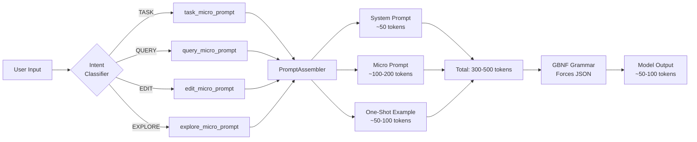
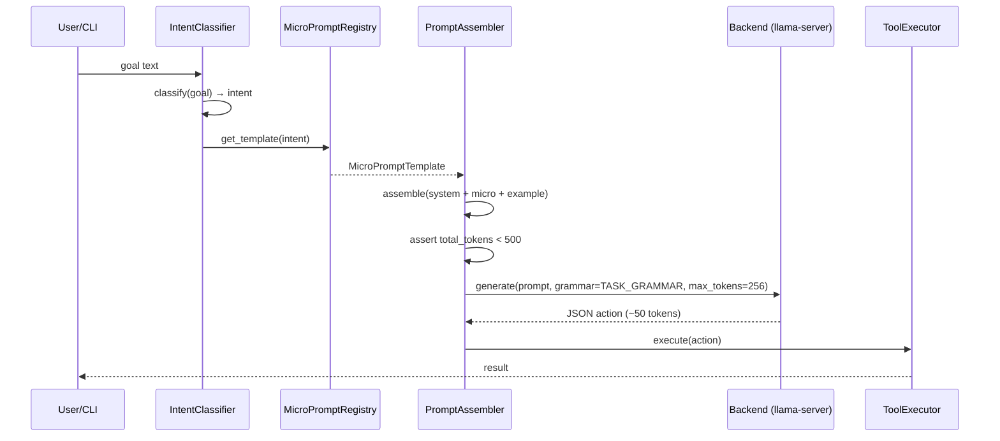
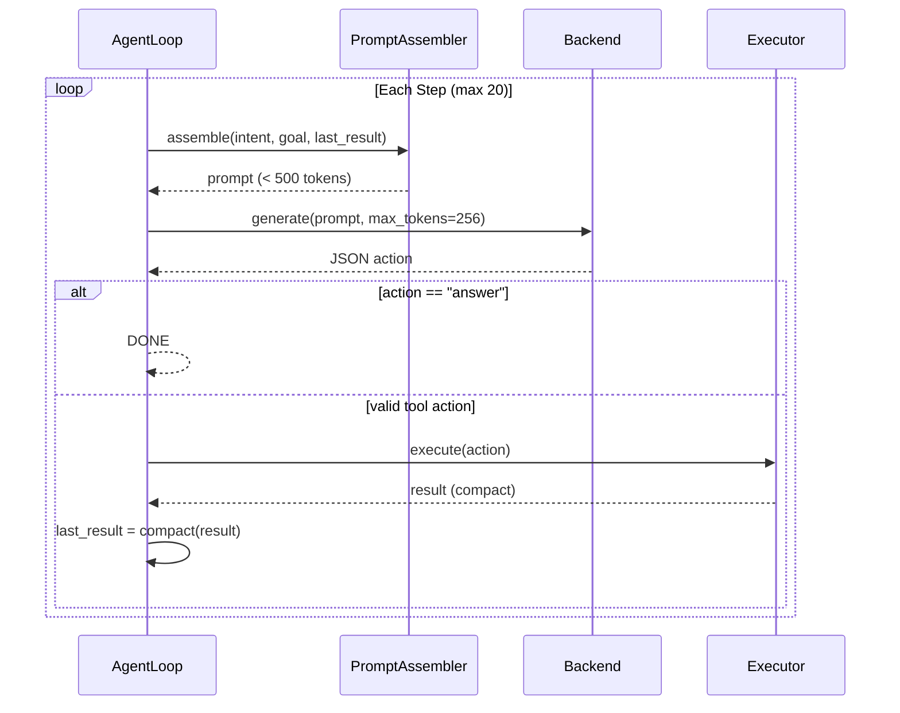

# Design Document: Minimal Prompt System

## Overview

The Minimal Prompt System replaces the current monolithic prompt architecture in mini_ai with an ultra-lean, modular design optimized for 3B parameter models on constrained hardware (i5-10210U, 8GB RAM). The current system builds prompts of 2000-4000 tokens containing rules, edit instructions, tool schemas, repo maps, and session context — causing 188+ second generation times and 2676-token narration outputs instead of short JSON actions.

The new architecture enforces a strict separation: a 2-3 line system prompt (~50 tokens) that never changes, plus task-specific micro-prompt templates (~100-200 tokens) injected only when needed. Combined with GBNF grammar enforcement, the model receives under 500 tokens total and generates under 256 tokens — targeting 10-20 second response times.

This is a fundamental architectural shift from "tell the model everything" to "tell the model only what it needs right now."

## Architecture

```mermaid
graph TD
    subgraph "Current Architecture (BEFORE)"
        A1[User Goal] --> B1[_build_system_prompt]
        B1 --> C1[Monolithic Prompt<br/>2000-4000 tokens]
        C1 --> D1[Rules + Tools + Edit Instructions<br/>+ Repo Map + Memory + RAG]
        D1 --> E1[Model generates 1024-2048 tokens<br/>mostly narration]
    end

    subgraph "New Architecture (AFTER)"
        A2[User Goal] --> B2[IntentClassifier]
        B2 --> C2[MicroPromptRegistry]
        C2 --> D2[PromptAssembler]
        D2 --> E2[Minimal Prompt<br/>300-500 tokens total]
        E2 --> F2[Model generates 50-100 tokens<br/>pure JSON action]
    end

    style C1 fill:#ff6b6b,color:#fff
    style E2 fill:#51cf66,color:#fff
```



### System Flow



## Sequence Diagrams

### Main Request Flow



### Multi-Step Agent Loop (Simplified)



## Components and Interfaces

### Component 1: MicroPromptTemplate

**Purpose**: Defines a single task-type prompt template with slots for dynamic content.

```python
@dataclass(frozen=True)
class MicroPromptTemplate:
    """Immutable micro-prompt template for a specific task type."""
    intent: str                    # "TASK", "QUERY", "EDIT", "EXPLORE"
    template: str                  # Template string with {goal}, {tools}, {example} slots
    one_shot_example: str          # Concrete JSON example for this task type
    available_tools: list[str]     # Tool names (not schemas) available for this intent
    max_prompt_tokens: int = 500   # Hard cap for assembled prompt
    max_gen_tokens: int = 256      # Generation limit
```

**Responsibilities**:
- Store the minimal template text for one intent type
- Provide the one-shot example that shows the model exactly what to output
- List tool names (not full schemas) available for this intent

### Component 2: MicroPromptRegistry

**Purpose**: Registry of all micro-prompt templates, indexed by intent.

```python
class MicroPromptRegistry:
    """Registry of micro-prompt templates indexed by intent type."""
    
    def __init__(self) -> None:
        self._templates: dict[str, MicroPromptTemplate] = {}
        self._register_defaults()
    
    def get(self, intent: str) -> MicroPromptTemplate:
        """Get template for intent. Falls back to EXPLORE if unknown."""
        ...
    
    def register(self, template: MicroPromptTemplate) -> None:
        """Register or override a template."""
        ...
    
    def _register_defaults(self) -> None:
        """Register built-in templates for TASK, QUERY, EDIT, EXPLORE."""
        ...
```

**Responsibilities**:
- Maintain the mapping of intent → template
- Provide fallback behavior for unknown intents
- Allow runtime registration of custom templates

### Component 3: PromptAssembler

**Purpose**: Assembles the final prompt from system prompt + micro-prompt + context, enforcing token budget.

```python
class PromptAssembler:
    """Assembles minimal prompts within strict token budgets."""
    
    SYSTEM_PROMPT: str = (
        "You execute tasks by outputting a single JSON action. "
        "Format: {\"action\": \"tool_name\", ...params}"
    )
    
    def __init__(self, registry: MicroPromptRegistry, max_total_tokens: int = 500):
        self._registry = registry
        self._max_tokens = max_total_tokens
    
    def assemble(
        self,
        intent: str,
        goal: str,
        last_result: str | None = None,
        step: int = 1,
    ) -> str:
        """Build the complete prompt under token budget."""
        ...
    
    def estimate_tokens(self, text: str) -> int:
        """Estimate tokens (len // 4 heuristic)."""
        ...
```

**Responsibilities**:
- Combine system prompt + micro-prompt template + goal + last result
- Enforce hard token cap (500 tokens for TASK, 700 for EDIT/EXPLORE)
- Truncate context aggressively if over budget
- Never include repo maps, memory, RAG, or session context for TASK intent

### Component 4: IntentClassifier (existing, unchanged)

**Purpose**: Classifies user goal into intent type. Already exists in the codebase.

**Interface** (unchanged):
```python
def classify_intent(goal: str) -> str:
    """Returns one of: TASK, QUERY, EDIT, EXPLORE, COMPLEX"""
    ...
```

## Data Models

### MicroPromptTemplate

```python
@dataclass(frozen=True)
class MicroPromptTemplate:
    intent: str
    template: str
    one_shot_example: str
    available_tools: list[str]
    max_prompt_tokens: int = 500
    max_gen_tokens: int = 256
```

**Validation Rules**:
- `intent` must be one of: "TASK", "QUERY", "EDIT", "EXPLORE", "COMPLEX"
- `template` must contain `{goal}` placeholder
- `one_shot_example` must be valid JSON with `"action"` key
- `available_tools` must be non-empty
- `max_prompt_tokens` must be between 200 and 1000
- `max_gen_tokens` must be between 64 and 512

### AssembledPrompt (internal)

```python
@dataclass
class AssembledPrompt:
    system_text: str          # The 2-line system prompt (~50 tokens)
    user_text: str            # Micro-prompt + goal + example (~200-400 tokens)
    total_tokens: int         # Estimated total
    grammar: str | None       # GBNF grammar to enforce
    max_gen_tokens: int       # Generation cap
```

**Validation Rules**:
- `total_tokens` must be ≤ `max_prompt_tokens` from template
- `system_text` must be ≤ 60 tokens
- `grammar` should always be set for TASK and QUERY intents

## Algorithmic Pseudocode

### Main Assembly Algorithm

```python
def assemble_prompt(intent: str, goal: str, last_result: str | None, step: int) -> AssembledPrompt:
    """
    ALGORITHM: Assemble a minimal prompt for the given intent.
    
    INPUT: intent (str), goal (str), last_result (str|None), step (int)
    OUTPUT: AssembledPrompt with total_tokens < max_prompt_tokens
    
    PRECONDITIONS:
      - intent is one of TASK, QUERY, EDIT, EXPLORE, COMPLEX
      - goal is non-empty string
      - step >= 1
    
    POSTCONDITIONS:
      - result.total_tokens <= template.max_prompt_tokens
      - result.system_text == SYSTEM_PROMPT (constant)
      - result.user_text contains goal text
      - result.grammar is set for TASK/QUERY intents
    """
    # Step 1: Get template for this intent
    template = registry.get(intent)
    
    # Step 2: Build system prompt (constant, ~50 tokens)
    system_text = SYSTEM_PROMPT  # Never changes
    
    # Step 3: Format micro-prompt with goal
    tools_str = ", ".join(template.available_tools)
    
    if step == 1 or last_result is None:
        # First step: include one-shot example
        user_text = template.template.format(
            goal=truncate(goal, 200),
            tools=tools_str,
            example=template.one_shot_example,
            context=""
        )
    else:
        # Subsequent steps: include last result instead of example
        compact_result = truncate(last_result, 300)
        user_text = template.template.format(
            goal=truncate(goal, 100),
            tools=tools_str,
            example="",
            context=f"Last result: {compact_result}"
        )
    
    # Step 4: Enforce token budget
    total = estimate_tokens(system_text + user_text)
    if total > template.max_prompt_tokens:
        # Trim context first, then goal
        user_text = aggressive_truncate(user_text, template.max_prompt_tokens - 60)
    
    # Step 5: Select grammar
    grammar = select_grammar_for_intent(intent)
    
    return AssembledPrompt(
        system_text=system_text,
        user_text=user_text,
        total_tokens=estimate_tokens(system_text + user_text),
        grammar=grammar,
        max_gen_tokens=template.max_gen_tokens
    )
```

### Token Budget Enforcement

```python
def aggressive_truncate(text: str, max_tokens: int) -> str:
    """
    ALGORITHM: Truncate text to fit within token budget.
    
    INPUT: text (str), max_tokens (int)
    OUTPUT: truncated text with len//4 <= max_tokens
    
    PRECONDITIONS:
      - max_tokens > 50 (minimum useful content)
    
    POSTCONDITIONS:
      - estimate_tokens(result) <= max_tokens
      - If truncated, ends with "..."
    
    LOOP INVARIANT:
      - At each iteration, remaining chars decrease by at least 1
    """
    max_chars = max_tokens * 4
    if len(text) <= max_chars:
        return text
    
    # Keep first portion (goal is always at the start)
    return text[:max_chars - 3] + "..."
```

### Intent-to-Grammar Mapping

```python
def select_grammar_for_intent(intent: str) -> str | None:
    """
    ALGORITHM: Select GBNF grammar based on intent type.
    
    INPUT: intent (str)
    OUTPUT: grammar string or None
    
    PRECONDITIONS:
      - intent is a valid intent string
    
    POSTCONDITIONS:
      - TASK/QUERY always return a grammar (never None)
      - EDIT may return None (needs free-form for SEARCH/REPLACE blocks)
    """
    if intent in ("TASK", "QUERY", "EXPLORE"):
        return MINIMAL_JSON_GRAMMAR  # Simplified grammar without "plan" field
    elif intent == "EDIT":
        return None  # Edit uses SEARCH/REPLACE blocks, not JSON
    else:
        return MINIMAL_JSON_GRAMMAR
```

## Key Functions with Formal Specifications

### Function 1: `MicroPromptRegistry.get()`

```python
def get(self, intent: str) -> MicroPromptTemplate:
    """Retrieve template for the given intent."""
```

**Preconditions:**
- `intent` is a non-empty string

**Postconditions:**
- Returns a valid `MicroPromptTemplate` instance
- If `intent` not found, returns the EXPLORE template (safe fallback)
- Never raises an exception

**Loop Invariants:** N/A

### Function 2: `PromptAssembler.assemble()`

```python
def assemble(self, intent: str, goal: str, last_result: str | None = None, step: int = 1) -> str:
    """Build complete prompt string under token budget."""
```

**Preconditions:**
- `intent` is a valid intent string
- `goal` is non-empty
- `step` >= 1
- `last_result` may be None (first step) or a string (subsequent steps)

**Postconditions:**
- Returns a string with `estimate_tokens(result) <= template.max_prompt_tokens`
- Result always contains the goal text (possibly truncated)
- For step == 1: result contains the one-shot example
- For step > 1 with last_result: result contains compact last_result
- System prompt portion is always exactly SYSTEM_PROMPT (constant)

**Loop Invariants:** N/A (no loops)

### Function 3: `build_minimal_system_prompt()`

```python
def build_minimal_system_prompt() -> str:
    """Return the constant 2-line system prompt."""
```

**Preconditions:** None

**Postconditions:**
- Returns a string with `estimate_tokens(result) <= 60`
- Result is always the same string (pure function)
- Contains the JSON format instruction

**Loop Invariants:** N/A

## Example Usage

```python
# --- Setup ---
from mini_ai.core.micro_prompts import MicroPromptRegistry, PromptAssembler

registry = MicroPromptRegistry()  # Auto-registers defaults
assembler = PromptAssembler(registry)

# --- Example 1: TASK intent (install a package) ---
prompt = assembler.assemble(
    intent="TASK",
    goal="Install React with TypeScript template",
    last_result=None,
    step=1,
)
# Result (~350 tokens):
# System: "You execute tasks by outputting a single JSON action. Format: {"action": "tool_name", ...params}"
# User: "Goal: Install React with TypeScript template
#        Tools: run_cmd, write_files, list_dir, answer
#        Example: {"action": "run_cmd", "cmd": "npx create-react-app myapp --template typescript"}
#        Output JSON:"

# --- Example 2: QUERY intent (answer a question) ---
prompt = assembler.assemble(
    intent="QUERY",
    goal="What version of Python is installed?",
    last_result=None,
    step=1,
)
# Result (~250 tokens):
# System: "You execute tasks by outputting a single JSON action. Format: {"action": "tool_name", ...params}"
# User: "Goal: What version of Python is installed?
#        Tools: run_cmd, answer
#        Example: {"action": "run_cmd", "cmd": "python --version"}
#        Output JSON:"

# --- Example 3: Step 2 with previous result ---
prompt = assembler.assemble(
    intent="TASK",
    goal="Install React with TypeScript template",
    last_result='{"exit_code": 0, "stdout": "Created myapp/"}',
    step=2,
)
# Result (~300 tokens):
# System: [same constant]
# User: "Goal: Install React with TypeScript template
#        Tools: run_cmd, write_files, list_dir, answer
#        Last result: exit_code=0, stdout=Created myapp/
#        Output JSON:"

# --- Example 4: Using in the agent loop ---
from mini_ai.core.backend import generate
from mini_ai.core.grammars import MINIMAL_JSON_GRAMMAR

result = generate(
    config,
    prompt=prompt,
    max_tokens=256,
    system_text=assembler.SYSTEM_PROMPT,
    grammar=MINIMAL_JSON_GRAMMAR,
)
# Model outputs: {"action": "answer", "content": "Done. React app created at myapp/"}
```

## Correctness Properties

*A property is a characteristic or behavior that should hold true across all valid executions of a system—essentially, a formal statement about what the system should do. Properties serve as the bridge between human-readable specifications and machine-verifiable correctness guarantees.*

### Property 1: Token Budget Invariant

*For any* valid intent and *for any* goal string of arbitrary length, the estimated token count of the assembled prompt SHALL never exceed the template's max_prompt_tokens value. This holds regardless of last_result content or step number.

**Validates: Requirements 3.3, 4.2, 4.5, 4.6, 4.7, 4.8**

### Property 2: System Prompt Constancy

*For any* two calls to the PromptAssembler with any combination of intents, goals, last_results, and steps, the system prompt portion of the assembled output SHALL be identical.

**Validates: Requirements 3.1, 4.4**

### Property 3: Goal Preservation

*For any* goal string of at least 50 characters and *for any* valid intent, the assembled prompt SHALL contain at least the first 50 characters of the goal.

**Validates: Requirements 3.2, 3.7**

### Property 4: One-Shot Example on First Step

*For any* valid intent and *for any* goal, when step equals 1 and last_result is None, the assembled prompt SHALL contain the template's one_shot_example text.

**Validates: Requirements 3.4**

### Property 5: Last Result Replaces Example on Subsequent Steps

*For any* valid intent, *for any* goal, and *for any* non-None last_result string, when step is greater than 1, the assembled prompt SHALL contain content derived from last_result and SHALL NOT contain the one_shot_example.

**Validates: Requirements 3.5**

### Property 6: Grammar Enforcement for JSON Intents

*For any* intent in {TASK, QUERY, EXPLORE}, the grammar selection function SHALL return a non-None GBNF grammar. For EDIT intent, it SHALL return None.

**Validates: Requirements 5.1, 5.2, 5.3, 5.4**

### Property 7: Registry Idempotence

*For any* intent string, calling MicroPromptRegistry.get() twice with the same intent SHALL return the same template instance.

**Validates: Requirements 2.5**

### Property 8: Unknown Intent Fallback

*For any* string that is not one of the valid intent types (TASK, QUERY, EDIT, EXPLORE, COMPLEX), the MicroPromptRegistry SHALL return the EXPLORE template.

**Validates: Requirements 2.3, 8.2**

### Property 9: Valid Intent Returns Matching Template

*For any* valid intent string in {TASK, QUERY, EDIT, EXPLORE}, the MicroPromptRegistry SHALL return a template whose intent field matches the requested intent.

**Validates: Requirements 2.2**

### Property 10: Template Validation

*For any* MicroPromptTemplate instance that passes construction, the intent SHALL be one of the valid types, the template SHALL contain `{goal}`, the one_shot_example SHALL be valid JSON with an "action" key, available_tools SHALL be non-empty, max_prompt_tokens SHALL be in [200, 1000], and max_gen_tokens SHALL be in [64, 512].

**Validates: Requirements 1.1, 1.2, 1.3, 1.4, 1.5, 1.6**

### Property 11: Token Estimation Consistency

*For any* string, the token estimation function SHALL return a value equal to the length of the string divided by 4 (integer division).

**Validates: Requirements 4.1**

### Property 12: Truncation Indicator

*For any* goal string long enough to trigger truncation, the assembled prompt SHALL contain "..." as a truncation indicator.

**Validates: Requirements 4.3**

### Property 13: No Bloat for TASK Intent

*For any* goal string, when assembling with TASK intent, the assembled prompt SHALL NOT contain the substrings "repo_map", "memory", "rag", or "session".

**Validates: Requirements 6.3**

### Property 14: Generation Token Limits per Intent

*For any* TASK assembly, the max_gen_tokens SHALL be 256. *For any* QUERY assembly, the max_gen_tokens SHALL be 128.

**Validates: Requirements 7.2**

### Property 15: Intent Classifier Valid Output

*For any* non-empty input string, the IntentClassifier SHALL return one of: TASK, QUERY, EDIT, EXPLORE, or COMPLEX.

**Validates: Requirements 6.1**

## Error Handling

### Error Scenario 1: Token Budget Exceeded After Truncation

**Condition**: Even after aggressive truncation, the prompt exceeds the budget (should be impossible with correct truncation logic, but defensive).
**Response**: Log a warning, return the truncated prompt anyway (better to try than to fail).
**Recovery**: The grammar enforcement will still constrain output. Log metrics for debugging.

### Error Scenario 2: Unknown Intent Type

**Condition**: IntentClassifier returns an unexpected string.
**Response**: Fall back to EXPLORE template (most general, includes all tools).
**Recovery**: Log the unknown intent for future template creation.

### Error Scenario 3: Model Produces Empty Output Despite Grammar

**Condition**: llama-server returns empty content even with grammar enforcement.
**Response**: Retry once without grammar (adaptive grammar fallback already exists).
**Recovery**: If still empty, return a nudge prompt: `"Output JSON:"` and retry.

### Error Scenario 4: Invalid JSON Despite Grammar

**Condition**: Grammar enforcement fails (rare but possible with quantization artifacts).
**Response**: Use existing `SelfHealingParser` to repair JSON.
**Recovery**: If repair fails, inject a stronger nudge with the one-shot example repeated.

## Testing Strategy

### Unit Testing Approach

- Test `MicroPromptRegistry` returns correct templates for all intents
- Test `PromptAssembler` produces prompts under token budget for various goal lengths
- Test truncation logic preserves goal prefix
- Test grammar selection returns correct grammar per intent
- Test one-shot example is included on step 1 and excluded on step > 1 with result

### Property-Based Testing Approach

**Property Test Library**: hypothesis (Python)

Key properties to test with random inputs:
1. Token budget is never exceeded regardless of goal length (fuzz goal with arbitrary strings)
2. System prompt is always constant (invariant across all parameter combinations)
3. Assembled prompt is always non-empty
4. Grammar is always non-None for TASK/QUERY intents

### Integration Testing Approach

- End-to-end test: assemble prompt → send to llama-server → verify JSON output parses
- Benchmark test: measure actual generation time with minimal prompt vs. old monolithic prompt
- Regression test: verify the agent loop still completes standard tasks (install, edit, query)

## Performance Considerations

### Token Budget Targets

| Intent | System Prompt | Micro Prompt | Total Max | Gen Max |
|--------|--------------|--------------|-----------|---------|
| TASK   | ~50 tokens   | ~200 tokens  | 500       | 256     |
| QUERY  | ~50 tokens   | ~150 tokens  | 400       | 128     |
| EDIT   | ~50 tokens   | ~300 tokens  | 700       | 512     |
| EXPLORE| ~50 tokens   | ~250 tokens  | 600       | 256     |

### Expected Performance Gains

- **Pre-fill time**: From 188s (4000 tokens) → ~15s (500 tokens) — proportional to token count
- **Generation time**: From 2676 tokens → ~50-100 tokens — 25-50x fewer tokens to generate
- **Total response time**: Target 10-20 seconds per action (down from 188+ seconds)
- **Memory**: Reduced prompt string allocation, no repo map computation for TASK

### Why This Works on 3B Models

1. **Short prompts = less confusion**: 3B models lose coherence with long contexts. 500 tokens is within their effective attention window.
2. **Grammar enforcement**: GBNF grammar makes the format instruction in the system prompt redundant — the model physically cannot output non-JSON.
3. **One-shot example**: Instead of 13 rules the model ignores, one concrete example shows exactly what to do.
4. **No narration possible**: With grammar + 256 token limit, the model can't waste tokens on "I will now..." preambles.

## Security Considerations

- **No secrets in prompts**: The minimal system never includes environment variables or credentials.
- **Tool name allowlist**: Grammar enforces only registered tool names can appear in output.
- **Path validation**: Unchanged — ToolExecutor still validates all paths before execution.
- **No prompt injection surface**: With only ~50 tokens of system prompt, there's minimal surface for injection attacks via user goals. The grammar prevents the model from outputting anything except valid JSON actions.

## Dependencies

- **Existing**: `mini_ai.core.backend.generate()` — unchanged, just called with smaller prompts
- **Existing**: `mini_ai.core.grammars` — add new `MINIMAL_JSON_GRAMMAR` (simplified, no "plan" field)
- **Existing**: `mini_ai.core.config.Config` — no changes needed
- **Existing**: `mini_ai.agents.agent.agent_mode()` — refactored to use `PromptAssembler`
- **New module**: `mini_ai.core.micro_prompts` — contains `MicroPromptTemplate`, `MicroPromptRegistry`, `PromptAssembler`
- **No new external dependencies** — pure Python, no pip installs required
