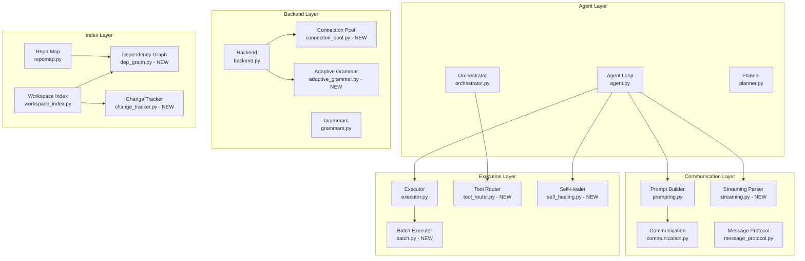
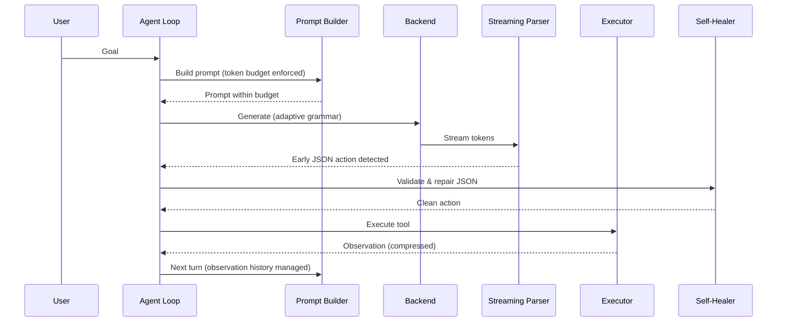

# Design Document: Performance Optimization

## Overview

This design addresses 15 performance and reliability requirements for mini_ai v39, a Python-based AI assistant running local LLMs (primarily Qwen2.5 3B) via llama-server with GBNF grammar enforcement on laptop hardware.

The optimizations target four pillars:
1. **Resource efficiency** — Lazy loading, connection pooling, token budget management
2. **Workspace intelligence** — Dependency graphs, cross-reference repo maps, file change tracking
3. **Communication reliability** — Structured protocols, adaptive grammars, streaming parsing
4. **Tool calling robustness** — Self-healing JSON, multi-action batches, context-aware routing, loop detection

The design preserves the existing module boundaries (`agent.py`, `backend.py`, `executor.py`, `workspace_index.py`, `repo.py`, `prompting.py`, `communication.py`, `grammars.py`, `config.py`) and extends them with new classes and functions rather than rewriting.

### Design Rationale

The system runs on laptops with 8GB RAM and often CPU-only inference. Every token of prompt space and every millisecond of startup time matters. The design prioritizes:
- **Incremental adoption** — Each optimization can be enabled independently
- **Backward compatibility** — Existing tool schemas and agent loop structure remain intact
- **Measurable impact** — Each requirement has concrete performance thresholds

## Architecture



### Module Dependency Flow



## Components and Interfaces

### 1. Lazy Module Loader (`mini_ai/core/lazy_loader.py` — NEW)

```python
class LazyModule:
    """Deferred import proxy. Loads module on first attribute access."""
    def __init__(self, module_name: str, package: str | None = None):
        self._module_name = module_name
        self._package = package
        self._module = None
        self._load_time_ms: float | None = None

    def __getattr__(self, name: str) -> Any:
        if self._module is None:
            self._load()
        return getattr(self._module, name)

    def _load(self) -> None:
        start = time.perf_counter()
        self._module = importlib.import_module(self._module_name, self._package)
        self._load_time_ms = (time.perf_counter() - start) * 1000
        if self._load_time_ms > 200:
            logger.warning(f"Slow import: {self._module_name} took {self._load_time_ms:.0f}ms")

# Usage in agent.py:
psutil = LazyModule("psutil")
health_monitor = LazyModule(".health_monitor", package="mini_ai.core")
rag_manager = LazyModule(".rag", package="mini_ai.core")
```

### 2. Token Budget Manager (`mini_ai/core/prompting.py` — EXTENDED)

```python
class TokenBudgetManager:
    """Enforces strict token budgets with priority-based section trimming."""
    CHAR_TO_TOKEN_RATIO = 4

    def __init__(self, ctx_size: int):
        self.budget = min(ctx_size - 1096, 3000) if ctx_size <= 4096 else ctx_size - 1096
        self.sections: dict[str, PromptSection] = {}

    def add_section(self, name: str, content: str, priority: int, mandatory: bool = False):
        """Add a section. Priority 0 = highest (never dropped first)."""
        ...

    def build(self) -> str:
        """Assemble prompt within budget, dropping low-priority sections first."""
        ...

    def estimate_tokens(self, text: str) -> int:
        return len(text) // self.CHAR_TO_TOKEN_RATIO

@dataclass
class PromptSection:
    name: str
    content: str
    priority: int  # 0=GOAL/TOOLS (mandatory), 1=HISTORY, 2=CONTEXT, 3=REPO_MAP
    mandatory: bool = False
    max_tokens: int | None = None
```

### 3. Batch Executor (`mini_ai/core/batch.py` — NEW)

```python
class BatchExecutor:
    """Parallel file operations with thread pooling."""
    MAX_BATCH_SIZE = 50
    MAX_WORKERS = 4

    def batch_read(self, paths: list[str], pm: PathManager) -> BatchResult:
        """Read files concurrently. Returns per-file results."""
        ...

    def batch_write(self, files: list[dict], writer: SafeFileWriter) -> BatchResult:
        """Write files concurrently. Returns per-file status."""
        ...

@dataclass
class BatchResult:
    succeeded: list[FileResult]
    failed: list[FileResult]
    duration_ms: float

    @property
    def summary(self) -> str:
        return f"{len(self.succeeded)} ok, {len(self.failed)} failed in {self.duration_ms:.0f}ms"
```

### 4. Dependency Graph (`mini_ai/core/dep_graph.py` — NEW)

```python
class DependencyGraph:
    """Directed graph of file imports for workspace intelligence."""

    def __init__(self, root: Path):
        self.root = root
        self._imports: dict[str, set[str]] = {}  # file -> set of files it imports
        self._importers: dict[str, set[str]] = {}  # file -> set of files that import it
        self._functions: dict[str, FunctionInfo] = {}  # "module.func" -> info

    def build_from_index(self, workspace_index: dict) -> None:
        """Parse import statements from indexed text files."""
        ...

    def invalidate(self, changed_file: str) -> set[str]:
        """Return set of files to re-index (changed + direct dependents)."""
        ...

    def get_function_info(self, name: str) -> FunctionInfo | None:
        """Lookup function by name, return file, lines, callers."""
        ...

    def files_within_hops(self, start: str, max_hops: int = 2) -> set[str]:
        """BFS traversal returning files within N dependency hops."""
        ...

@dataclass
class FunctionInfo:
    file: str
    name: str
    start_line: int
    end_line: int
    callers: list[str]
```

### 5. Enhanced Repo Map (`mini_ai/tools/repomap.py` — EXTENDED)

```python
FILE_ROLES = {"entry_point", "utility", "model", "controller", "test", "config", "unknown"}

def classify_file_role(path: str, signatures: list[str]) -> str:
    """Assign a role from the closed set based on path patterns and signatures."""
    ...

def generate_repo_map_v2(
    root: str,
    goal: str = "",
    dep_graph: DependencyGraph | None = None,
    max_tokens: int = 400,
) -> str:
    """Generate a goal-focused repo map with import edges and role annotations."""
    ...
```

### 6. Structured Communication Protocol (`mini_ai/core/communication.py` — EXTENDED)

```python
SECTION_LABELS = ["[GOAL]", "[HISTORY]", "[CONTEXT]", "[TOOLS]", "[MEMORY]", "[REPO_MAP]"]
MANDATORY_SECTIONS = {"[GOAL]", "[TOOLS]"}

class StructuredPromptFormatter:
    """Formats prompt sections with labeled delimiters."""

    def format(self, sections: dict[str, str]) -> str:
        """Produce labeled prompt: [GOAL] ... [HISTORY] ... etc."""
        ...

class ResponseValidator:
    """Validates model JSON responses before passing to executor."""

    def validate(self, raw: str) -> tuple[bool, dict | None, str]:
        """Returns (valid, parsed_action, error_message)."""
        ...

class ToolSuccessTracker:
    """Tracks per-session tool success/failure for recommendations."""

    def record(self, tool: str, success: bool) -> None: ...
    def get_recommendations(self, min_invocations: int = 5, top_k: int = 3) -> list[str]: ...
```

### 7. Adaptive Grammar Selector (`mini_ai/core/adaptive_grammar.py` — NEW)

```python
class AdaptiveGrammarSelector:
    """Selects grammar based on model size and runtime behavior."""

    def __init__(self, config: Config):
        self.model_size_b = self._detect_model_size(config.model)
        self.empty_response_count = 0
        self.grammar_disabled = False

    def _detect_model_size(self, model_path: Path | None) -> float:
        """Extract parameter count from GGUF filename (e.g., '3B' -> 3.0)."""
        ...

    def select_grammar(self) -> str | None:
        """Return appropriate grammar or None if disabled."""
        if self.grammar_disabled:
            return None
        if self.model_size_b < 7:
            return THINK_JSON_GRAMMAR
        return JSON_ACTION_GRAMMAR

    def record_empty_response(self) -> None:
        """Track consecutive empty responses. Disable grammar after 2."""
        self.empty_response_count += 1
        if self.empty_response_count >= 2:
            self.grammar_disabled = True
            logger.warning("Grammar disabled due to consecutive empty responses")

    def record_success(self) -> None:
        self.empty_response_count = 0
```

### 8. Tool Calling Reliability Pipeline (`mini_ai/core/tool_reliability.py` — NEW)

```python
class LoopDetector:
    """Sliding window loop detection for the agent loop."""
    WINDOW_SIZE = 10
    LOOP_THRESHOLD = 3

    def __init__(self):
        self._window: deque[str] = deque(maxlen=self.WINDOW_SIZE)

    def record(self, tool: str, params: dict) -> None: ...
    def is_looping(self) -> tuple[bool, str | None]: ...

class ToolDisabler:
    """Manages per-session tool enable/disable based on failure counts."""
    MAX_CONSECUTIVE_FAILURES = 3
    REQUIRED_CATEGORIES = {"filesystem": [...], "execution": [...], "output": [...]}

    def record_failure(self, tool: str) -> None: ...
    def record_success(self, tool: str) -> None: ...
    def get_disabled_tools(self) -> set[str]: ...
    def get_available_tools(self, base_tools: list[str]) -> list[str]: ...

class RecoverySuggester:
    """Maps error categories to concrete recovery actions."""
    ERROR_MAP = {
        "file-not-found": "List the parent directory to verify the path exists",
        "permission-denied": "Verify the path or try with elevated access",
        "timeout": "Reduce scope or increase timeout",
        "invalid-input": "Re-read the tool schema for correct parameters",
    }

    def suggest(self, error: Exception, tool: str) -> str: ...
```

### 9. Multi-Action Executor (`mini_ai/core/multi_action.py` — NEW)

```python
class MultiActionExecutor:
    """Executes action batches with dependency resolution."""
    MAX_BATCH_SIZE = 10

    def execute_batch(self, actions: list[dict], executor: ToolExecutor) -> BatchActionResult:
        """Execute actions respecting depends_on ordering."""
        ...

    def _validate_dependencies(self, actions: list[dict]) -> tuple[bool, str]:
        """Check for out-of-range indices and circular dependencies."""
        ...

    def _topological_sort(self, actions: list[dict]) -> list[list[int]]:
        """Return execution layers (parallel within layer, sequential between)."""
        ...

@dataclass
class BatchActionResult:
    results: dict[int, ActionResult]  # index -> result
    cancelled: list[int]  # indices cancelled due to dependency failure
```

### 10. Streaming Response Parser (`mini_ai/core/streaming.py` — NEW)

```python
class StreamingActionParser:
    """Parses JSON actions from streaming tokens using brace-depth tracking."""

    def __init__(self, schema_registry: dict[str, ToolSchema]):
        self._buffer = ""
        self._brace_depth = 0
        self._candidates: list[str] = []

    def feed(self, token: str) -> ParseEvent | None:
        """Feed a token. Returns ParseEvent.ACTION_READY when valid action found."""
        ...

    def get_action(self) -> dict | None:
        """Return the validated action if one was detected."""
        ...

class ParseEvent(Enum):
    BUFFERING = "buffering"
    ACTION_READY = "action_ready"
    INVALID_CANDIDATE = "invalid_candidate"
    STREAM_END = "stream_end"
```

### 11. Context-Aware Tool Router (`mini_ai/core/tool_router.py` — NEW)

```python
TASK_TOOL_SETS = {
    "code_editing": ["edit_blocks", "read_files", "run_cmd", "answer"],
    "exploration": ["read_files", "list_dir", "workspace_scan", "search_files", "web_search", "answer"],
    "default": ["read_files", "list_dir", "run_cmd", "write_files", "edit_blocks", "answer"],
}
MAX_TOOLS_PER_TURN = 8

class ToolRouter:
    """Selects tool sets based on task classification and workspace context."""

    def __init__(self, workspace_index: dict, capabilities: dict):
        self._index = workspace_index
        self._capabilities = capabilities

    def route(self, task_type: str, goal: str = "") -> list[str]:
        """Return filtered tool list (max 8) for the given task type."""
        ...

    def _detect_framework_tools(self) -> list[str]:
        """Add framework-specific tools based on workspace stack detection."""
        ...

    def suggest_alternative(self, requested_tool: str, available: list[str]) -> str | None:
        """Find equivalent tool in available set for unavailable tool requests."""
        ...
```

### 12. Observation Compressor (`mini_ai/core/communication.py` — EXTENDED)

```python
class ObservationCompressor:
    """Intelligent compression of tool outputs for context efficiency."""
    COMPRESS_THRESHOLD = 1000
    MAX_COMPRESSED = 500
    CMD_KEEP_HEAD = 200
    CMD_KEEP_TAIL = 500

    def compress(self, tool: str, output: str, success: bool) -> str:
        """Compress output based on tool type and size."""
        ...

    def deduplicate(self, observations: list[str]) -> list[str]:
        """Replace consecutive identical observations with repetition count."""
        ...

    def summarize_old(self, observations: list[str], budget_chars: int) -> str:
        """Summarize observations older than 3 turns into progress line."""
        ...
```

### 13. Connection Pool (`mini_ai/core/connection_pool.py` — NEW)

```python
class ConnectionPool:
    """HTTP connection pool for llama-server communication."""
    MAX_CONNECTIONS = 4
    KEEP_ALIVE = True

    def __init__(self, base_url: str):
        self._base_url = base_url
        self._pool: list[http.client.HTTPConnection] = []

    def get_connection(self) -> http.client.HTTPConnection: ...
    def release(self, conn: http.client.HTTPConnection) -> None: ...
    def pre_warm(self) -> None:
        """Send empty prompt with n_predict=1 to warm KV cache."""
        ...

class RetryPolicy:
    """Exponential backoff for 503 responses."""
    MAX_RETRIES = 3
    INITIAL_DELAY = 1.0

    def execute_with_retry(self, request_fn: Callable) -> Any: ...

class ReconnectionManager:
    """Auto-reconnect on connection loss."""
    POLL_INTERVAL = 5  # seconds
    MAX_WAIT = 60  # seconds

    def wait_for_server(self, health_url: str) -> bool: ...
```

### 14. File Change Tracker (`mini_ai/core/change_tracker.py` — NEW)

```python
class FileChangeTracker:
    """Tracks file modifications during a session using mtime comparison."""

    def __init__(self):
        self._mtime_cache: dict[str, float] = {}
        self._modified_files: list[str] = []  # relative paths, max 50

    def check_file(self, path: Path) -> bool:
        """Compare stored mtime with disk. Returns True if changed."""
        ...

    def record_write(self, path: Path) -> None:
        """Update cache after executor writes a file."""
        ...

    def get_modified_files(self) -> list[str]:
        """Return list of modified files (max 50 most recent)."""
        ...

    def should_reindex(self) -> bool:
        """True if >20 files modified, triggering incremental re-index."""
        ...

    def get_files_for_reindex(self, dep_graph: DependencyGraph) -> set[str]:
        """Modified files + their direct importers."""
        ...
```

### 15. Self-Healing JSON Parser (`mini_ai/core/self_healing.py` — NEW)

```python
class SelfHealingParser:
    """Repairs common JSON errors from small models."""

    def __init__(self, tool_registry: dict[str, ToolSchema]):
        self._registry = tool_registry
        self._correction_log: Counter = Counter()

    def parse(self, raw: str) -> tuple[dict | None, list[str]]:
        """Parse with repair. Returns (action, corrections_applied)."""
        ...

    def _fix_single_quotes(self, text: str) -> str: ...
    def _fix_backslashes(self, text: str) -> str: ...
    def _fix_trailing_commas(self, text: str) -> str: ...
    def _fix_tool_name(self, name: str) -> str | None:
        """Levenshtein correction for close tool name matches."""
        ...

    def get_session_hints(self, min_count: int = 2, top_k: int = 3) -> str:
        """Return top corrections as hints for the system prompt."""
        ...
```

## Data Models

### Core Data Structures

```python
@dataclass
class PromptSection:
    """A labeled section of the prompt with priority metadata."""
    name: str          # e.g., "GOAL", "HISTORY", "CONTEXT", "TOOLS", "REPO_MAP"
    content: str
    priority: int      # 0 = highest (never dropped), 3 = lowest (dropped first)
    mandatory: bool    # If True, never dropped regardless of budget
    max_tokens: int | None = None  # Per-section cap

@dataclass
class FileResult:
    """Result of a single file operation in a batch."""
    path: str
    success: bool
    content: str | None = None  # For reads
    error: str | None = None    # For failures
    size: int = 0

@dataclass
class BatchResult:
    """Aggregated result of a batch file operation."""
    succeeded: list[FileResult]
    failed: list[FileResult]
    duration_ms: float

@dataclass
class FunctionInfo:
    """Function metadata stored in the dependency graph."""
    file: str
    name: str
    start_line: int
    end_line: int
    callers: list[str] = field(default_factory=list)

@dataclass
class ActionResult:
    """Result of a single action in a multi-action batch."""
    index: int
    tool: str
    success: bool
    output: str
    cancelled: bool = False

@dataclass
class BatchActionResult:
    """Aggregated result of a multi-action batch execution."""
    results: dict[int, ActionResult]
    cancelled: list[int]

@dataclass
class ParseCandidate:
    """A potential JSON action extracted from streaming tokens."""
    json_str: str
    start_offset: int
    end_offset: int
    valid: bool = False

@dataclass
class ToolSuccessRecord:
    """Per-tool success tracking for recommendations."""
    tool: str
    total: int = 0
    successes: int = 0
    consecutive_failures: int = 0

    @property
    def success_ratio(self) -> float:
        return self.successes / self.total if self.total > 0 else 0.0

@dataclass
class CorrectionEntry:
    """A recorded JSON correction for session hints."""
    error_type: str  # "single_quotes", "backslash", "tool_name", "trailing_comma"
    original: str
    corrected: str
    count: int = 1
```

### Configuration Extensions

```python
# Added to Config dataclass
@dataclass
class Config:
    # ... existing fields ...
    
    # New performance fields
    lazy_loading: bool = True
    token_budget_strict: bool = True  # Enforce hard token limits
    batch_max_workers: int = 4
    streaming_parse: bool = True
    grammar_adaptive: bool = True
    tool_routing: bool = True
    self_healing: bool = True
    max_tools_per_turn: int = 8
    connection_pool_size: int = 4
    reconnect_timeout: int = 60
```

### Grammar Extensions for Multi-Action

```python
# Extended GBNF to support {"actions": [...]} format
MULTI_ACTION_GRAMMAR = r'''
root    ::= (think space)? (single_action | multi_action)
think   ::= "<think>" [^<]* "</think>"
single_action ::= "{" space "\"plan\"" space ":" space string "," space "\"action\"" space ":" space tool_name ( "," space string space ":" space value )* space "}"
multi_action  ::= "{" space "\"plan\"" space ":" space string "," space "\"actions\"" space ":" space action_array space "}"
action_array  ::= "[" space action_obj ("," space action_obj)* space "]"
action_obj    ::= "{" space "\"action\"" space ":" space tool_name ( "," space string space ":" space value )* space "}"
tool_name ::= "\"answer\"" | "\"write_files\"" | "\"edit_blocks\"" | "\"read_files\"" | ...
value   ::= object | array | string | number | ("true" | "false" | "null")
array   ::= "[" space ( value ( "," space value )* )? space "]"
string  ::= "\"" ( [^"\\\x00-\x1F] | "\\" ( ["\\/bfnrt] | "u" [0-9a-fA-F] [0-9a-fA-F] [0-9a-fA-F] [0-9a-fA-F] ) )* "\""
number  ::= "-"? ([0-9] | [1-9] [0-9]*) ("." [0-9]+)? ([eE] [+-]? [0-9]+)?
space   ::= [ \t\n\r]*
'''
```

## Correctness Properties

*A property is a characteristic or behavior that should hold true across all valid executions of a system — essentially, a formal statement about what the system should do. Properties serve as the bridge between human-readable specifications and machine-verifiable correctness guarantees.*

### Property 1: Lazy loading defers imports until first use

*For any* module wrapped in `LazyModule`, the underlying module import SHALL NOT execute until the first attribute access on the proxy object, and after that access the module SHALL be fully available.

**Validates: Requirements 1.1**

### Property 2: Connection pool size invariant

*For any* sequence of connection acquire and release operations, the number of active (checked-out) connections SHALL never exceed the configured pool maximum (2 for agent connections, 4 for general pool).

**Validates: Requirements 1.3, 13.1**

### Property 3: Token budget enforcement with priority-based trimming

*For any* set of prompt sections with assigned priorities that collectively exceed the token budget, the `TokenBudgetManager.build()` output SHALL fit within the budget, mandatory sections (GOAL, TOOLS) SHALL always be present, and sections SHALL be dropped in reverse priority order (repo map first, then session context, then old observations).

**Validates: Requirements 2.1, 2.2**

### Property 4: Token estimation consistency

*For any* string `s`, `estimate_tokens(s)` SHALL equal `len(s) // 4`, and the prompt SHALL be rejected if this estimate exceeds the configured budget.

**Validates: Requirements 2.3**

### Property 5: Repo map BM25 filtering under budget pressure

*For any* repo map that exceeds 400 tokens (1600 characters), after truncation all remaining file entries SHALL have a BM25 relevance score above 1.5 for the current goal.

**Validates: Requirements 2.4**

### Property 6: Observation history summarization

*For any* observation history exceeding 2000 characters, all observations except the 3 most recent SHALL be summarized to single-line format containing only tool name and success/failure indicator.

**Validates: Requirements 2.5**

### Property 7: Batch read correctness with partial failure handling

*For any* set of 2–50 file paths (containing both valid and invalid paths), `batch_read` SHALL return content for every valid path matching what individual reads would produce, and SHALL return error information for every invalid path, without any valid path being affected by failures of other paths.

**Validates: Requirements 3.1, 3.4**

### Property 8: Batch write correctness with per-file status

*For any* set of 2–50 file write operations, `batch_write` SHALL return a per-file result containing success/failure status, file path, and error reason for failures, and the on-disk content of successfully written files SHALL match the requested content.

**Validates: Requirements 3.2**

### Property 9: Dependency graph invalidation scope

*For any* file `F` in a dependency graph, `invalidate(F)` SHALL return exactly the set `{F} ∪ {files that directly import F}` (one hop), and no files beyond one hop SHALL be invalidated.

**Validates: Requirements 4.2**

### Property 10: Function-to-file mapping round-trip

*For any* Python or JavaScript file containing top-level function definitions, the workspace index SHALL store a mapping from each function name to its file path, start line, and end line, and looking up that function name SHALL return the correct file and line range.

**Validates: Requirements 4.3, 4.4**

### Property 11: Incremental rebuild processes only changed files

*For any* workspace where a subset of files have changed mtime since last index, `rebuild_incremental` SHALL process only those files (plus remove entries for deleted files), leaving unchanged file entries intact.

**Validates: Requirements 4.6**

### Property 12: Repo map role classification from closed set

*For any* file path and signature set, `classify_file_role` SHALL return exactly one value from the set `{"entry_point", "utility", "model", "controller", "test", "config", "unknown"}`.

**Validates: Requirements 5.2**

### Property 13: Repo map hop-based filtering

*For any* dependency graph and starting file, `files_within_hops(start, 2)` SHALL return only files reachable within 2 directed edges (imports and their imports), and no file at distance > 2 SHALL appear.

**Validates: Requirements 5.3**

### Property 14: Structured prompt contains all mandatory labeled sections

*For any* set of prompt sections passed to `StructuredPromptFormatter.format()`, the output SHALL contain `[GOAL]` and `[TOOLS]` delimiters, and each non-empty section SHALL appear with its corresponding label.

**Validates: Requirements 6.1**

### Property 15: Response validation correctness

*For any* string that is valid JSON containing an `"action"` key whose value matches a registered tool name, `ResponseValidator.validate()` SHALL return `(True, parsed_dict, "")`. For any string that is not valid JSON or lacks a valid action key, it SHALL return `(False, None, error_message)`.

**Validates: Requirements 6.2**

### Property 16: Tool success recommendation accuracy

*For any* sequence of tool invocations where at least one tool has been invoked 5+ times, `get_recommendations()` SHALL return the top 3 tools ordered by success-to-total ratio, and only tools with ≥5 invocations SHALL be eligible.

**Validates: Requirements 6.6**

### Property 17: Adaptive grammar selection by model size

*For any* model with detected parameter count < 7B, `select_grammar()` SHALL return `THINK_JSON_GRAMMAR`. For any model with ≥ 7B parameters, it SHALL return `JSON_ACTION_GRAMMAR`.

**Validates: Requirements 7.1, 7.2**

### Property 18: GGUF filename size extraction

*For any* filename containing a numeric pattern followed by "B" (e.g., "qwen2.5-3B-instruct.gguf"), the parser SHALL extract the correct numeric value. For filenames without such a pattern, it SHALL default to a value < 7.

**Validates: Requirements 7.3, 7.4**

### Property 19: Schema validation produces correct structured errors

*For any* tool schema and action dict where N required parameters are missing or have wrong types, validation SHALL fail and the error response SHALL list exactly those N parameters with their expected types and a usage example.

**Validates: Requirements 8.1, 8.2**

### Property 20: Loop detection triggers at correct threshold

*For any* sequence of tool calls where the same `(tool_name, params)` tuple appears 3 or more times within a sliding window of 10 calls, the loop detector SHALL trigger. For sequences where no tuple appears 3+ times in any window of 10, it SHALL NOT trigger.

**Validates: Requirements 8.3**

### Property 21: Recovery suggestion mapping completeness

*For any* tool execution error categorized as one of `{file-not-found, permission-denied, timeout, invalid-input}`, the recovery suggester SHALL return the defined concrete suggestion for that category.

**Validates: Requirements 8.5**

### Property 22: Tool disabling on consecutive failures

*For any* tool with N consecutive failures, it SHALL be disabled (excluded from available tools) if and only if N ≥ 3. A subsequent valid explicit call SHALL re-enable it for one attempt.

**Validates: Requirements 8.6**

### Property 23: Multi-action dependency validation

*For any* action batch where `depends_on` references an out-of-range index (≥ batch length or < 0) or creates a circular dependency, `validate_dependencies` SHALL reject the entire batch. For any batch with valid acyclic dependencies, it SHALL accept.

**Validates: Requirements 9.3**

### Property 24: Multi-action failure propagation

*For any* action batch where action at index `i` fails, all actions that transitively depend on `i` SHALL be cancelled, and all actions independent of `i` SHALL complete normally with their results keyed by index.

**Validates: Requirements 9.4, 9.6**

### Property 25: Streaming parser detects action at brace-depth zero

*For any* valid JSON action object split into arbitrary token chunks, the streaming parser SHALL detect the complete action exactly when the brace depth counter returns to zero, and the parsed result SHALL equal the original action object.

**Validates: Requirements 10.1**

### Property 26: Tool routing produces correct bounded tool sets

*For any* task type from the defined set `{"code_editing", "exploration", "default"}`, the tool router SHALL return exactly the tools defined for that type plus any framework-specific tools, and the total SHALL NOT exceed 8 tools.

**Validates: Requirements 11.1, 11.2, 11.4**

### Property 27: Observation compression respects threshold

*For any* tool output exceeding 1000 characters, compression SHALL produce output ≤ 500 characters in the structured template format. For any output ≤ 1000 characters, the output SHALL pass through unmodified in the template format.

**Validates: Requirements 12.1, 12.6**

### Property 28: Command output truncation preserves head and tail

*For any* `run_cmd` output exceeding 2000 characters, the compressed result SHALL contain the first 200 characters, a truncation indicator showing the count of omitted characters, and the last 500 characters.

**Validates: Requirements 12.3**

### Property 29: Observation deduplication

*For any* list of observations containing K consecutive identical entries (K ≥ 2), deduplication SHALL replace them with a single instance followed by `[repeated K times]`.

**Validates: Requirements 12.4**

### Property 30: Retry with exponential backoff on 503

*For any* sequence of N consecutive 503 responses (N ≤ 3), the backend SHALL retry with delays following the pattern 1s, 2s, 4s. After 3 failed retries, it SHALL raise an error to the caller.

**Validates: Requirements 13.4**

### Property 31: File change detection via mtime

*For any* file where the on-disk mtime differs from the cached mtime, `check_file` SHALL return True (changed). For any file where mtimes match, it SHALL return False.

**Validates: Requirements 14.1, 14.6**

### Property 32: Modified files list cap

*For any* session where N files are modified (N > 50), the modified files list SHALL contain exactly the 50 most recently modified entries.

**Validates: Requirements 14.3**

### Property 33: Single-quote JSON repair round-trip

*For any* valid JSON action object where all double quotes are replaced with single quotes, the `_fix_single_quotes` repair function SHALL produce output that parses to an equivalent JSON object.

**Validates: Requirements 15.1**

### Property 34: Levenshtein tool name correction

*For any* string within Levenshtein distance ≤ 2 of exactly one valid tool name, the corrector SHALL return that tool name. For any string within distance ≤ 2 of multiple valid tool names, it SHALL reject with the list of candidates.

**Validates: Requirements 15.2, 15.3**

### Property 35: Extra fields are ignored during execution

*For any* valid action dict with additional fields not defined in the tool schema, the executor SHALL execute successfully using only the schema-defined parameters, ignoring unknown fields.

**Validates: Requirements 15.4**

### Property 36: Windows backslash repair

*For any* JSON string containing Windows-style paths with unescaped backslashes (e.g., `C:\Users\file.py`), the `_fix_backslashes` repair SHALL escape them to produce valid JSON that preserves the path value.

**Validates: Requirements 15.5**

### Property 37: Session correction hints reflect top errors

*For any* session where correction types have been logged with counts, `get_session_hints` SHALL return the top 3 correction types (each occurring ≥ 2 times) formatted as structured hints.

**Validates: Requirements 15.7**

## Error Handling

### Lazy Loading Failures
- If a module fails to import, log at WARNING level and skip that module's functionality
- The agent loop continues operating with remaining modules
- No cascading failures — each lazy module is independent

### Token Budget Overflow
- If prompt exceeds budget after all trimming: drop repo map entirely, log warning
- If still over budget (extreme case): truncate observation history to last entry only
- Never send a prompt that exceeds the configured token budget

### Batch Operation Failures
- Individual file failures do not abort the batch
- Each file gets its own success/failure status in the result
- Batch size > 50 is rejected immediately with clear error message
- Thread pool exceptions are caught per-file and reported

### Dependency Graph Errors
- Unparseable files are skipped with partial results (edges extracted before failure)
- Circular import detection logs a warning but doesn't crash the indexer
- Missing files in the graph are treated as external dependencies (no edges)

### Grammar Failures
- 2 consecutive empty responses → disable grammar for session
- Fallback to JSON parsing with repair (no grammar enforcement)
- If repair also fails → return error with corrective example

### Connection Failures
- 503 (busy): exponential backoff, 3 retries (1s, 2s, 4s)
- Connection refused: poll health endpoint every 5s for up to 60s
- Complete timeout: raise `NetworkError` with recovery suggestion
- All retries exhausted: clear error to caller with suggested action

### Multi-Action Failures
- Invalid dependency structure: reject entire batch immediately
- Single action failure: cancel all transitive dependents, continue independents
- Batch size > 10: reject with clear error

### Self-Healing Limits
- JSON repair gets exactly 1 re-parse attempt
- If repair fails: return error with corrective example showing valid syntax
- Ambiguous tool name matches (distance ≤ 2 to multiple tools): reject with candidates list
- Never silently change semantics — only fix syntax

### Streaming Parser Failures
- Invalid JSON candidate at brace-depth zero: discard, continue buffering
- Stream ends without valid JSON: treat entire output as reasoning text
- Parser adds no more than 50ms overhead (measured, not estimated)

## Testing Strategy

### Dual Testing Approach

This feature is well-suited for property-based testing because it contains many pure functions with clear input/output behavior, universal invariants, and large input spaces (strings, file paths, JSON structures, sequences of operations).

**Property-Based Tests** (using `hypothesis` library for Python):
- Minimum 100 iterations per property test
- Each test tagged with: `Feature: performance-optimization, Property {N}: {title}`
- Focus on: token budget logic, batch operations, dependency graph traversal, JSON repair, loop detection, compression, tool routing
- Generators for: random file paths, JSON action objects, tool call sequences, prompt sections, observation histories

**Unit Tests** (using `pytest`):
- Specific examples for edge cases (batch size = 50 vs 51, empty observations, syntax-error files)
- Integration points between components (executor → batch executor, backend → streaming parser)
- Error conditions (connection failures, unparseable files, ambiguous tool names)
- Mocked external dependencies (llama-server responses, filesystem operations)

### Test Organization

```
tests/
├── test_lazy_loader.py          # Property 1
├── test_token_budget.py         # Properties 3, 4, 5, 6
├── test_batch_executor.py       # Properties 7, 8
├── test_dep_graph.py            # Properties 9, 10, 11, 13
├── test_repo_map.py             # Properties 12, 13
├── test_communication.py        # Properties 14, 15, 16, 27, 28, 29
├── test_adaptive_grammar.py     # Properties 17, 18
├── test_tool_reliability.py     # Properties 19, 20, 21, 22
├── test_multi_action.py         # Properties 23, 24
├── test_streaming_parser.py     # Property 25
├── test_tool_router.py          # Property 26
├── test_connection_pool.py      # Property 30 (with mocked HTTP)
├── test_change_tracker.py       # Properties 31, 32
├── test_self_healing.py         # Properties 33, 34, 35, 36, 37
└── conftest.py                  # Shared fixtures and generators
```

### Property Test Configuration

```python
from hypothesis import given, settings, strategies as st

@settings(max_examples=100, deadline=None)
@given(sections=st_prompt_sections(), budget=st.integers(min_value=500, max_value=8000))
def test_token_budget_enforcement(sections, budget):
    """Feature: performance-optimization, Property 3: Token budget enforcement with priority-based trimming"""
    manager = TokenBudgetManager(budget)
    for s in sections:
        manager.add_section(s.name, s.content, s.priority, s.mandatory)
    result = manager.build()
    assert manager.estimate_tokens(result) <= budget
    assert "[GOAL]" in result
    assert "[TOOLS]" in result
```

### Integration Tests
- End-to-end agent loop with mocked llama-server testing the full pipeline
- Laravel project creation scenario (the target test case) exercising tool routing, batch operations, and self-healing
- Streaming response processing with simulated token streams
- Connection pool behavior under concurrent requests (mocked server)

### Performance Benchmarks (not PBT, run separately)
- Startup time with lazy loading (< 2s target)
- Batch read of 10 files (< 500ms target)
- Repo map generation for 200 files (< 2s target)
- Workspace index build for 10,000 files (< 30s target)
- Streaming parser latency overhead (< 50ms target)

